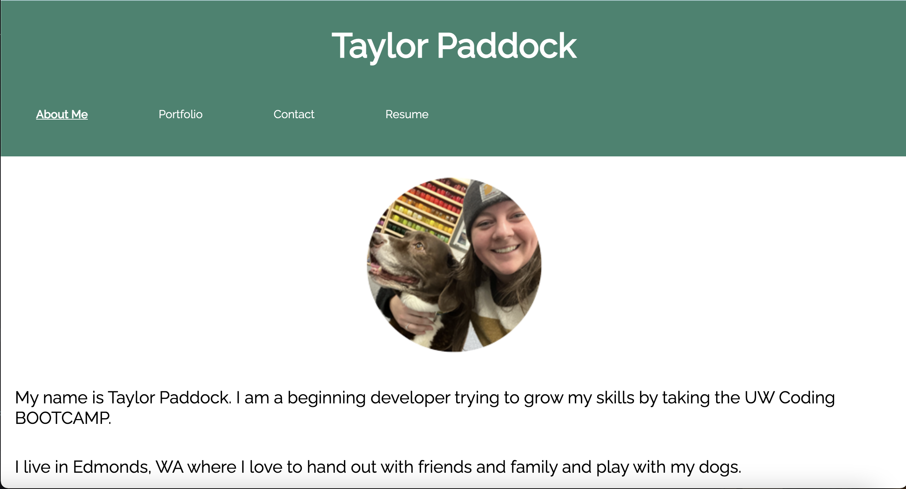

# react-portfolio

## Description

Grow your developer skills by using the latest technologies. This entire portfolio is built using React.

## Installation

To install please clone this repository from GitHub to your local terminal.

## Usage

In your integrated terminal, run 'npm i' and then 'npm start'

Deployed application: https://taylorpaddock.github.io/react-portfolio/

## Credits

Applied knowledge gained during Week 20 React in coding bootcamp as well as our final project for this bootcamp.

## How to Contribute

Turn this into your own profil page.  
Update css to use bootstrap or Ant Design.